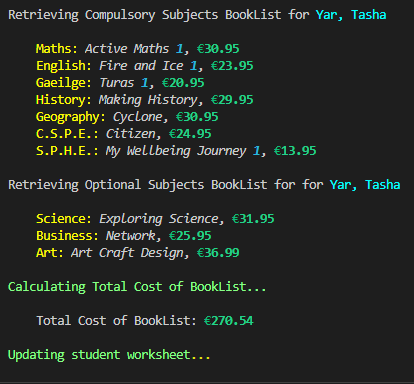

# BOOKLIST GENERATOR

Booklist Generator is a command line based Python program which handles data automation and runs on Heroku. 

It provides the user value in accessing the list of books and total cost for the specific subjects each student is using in their first year in a post-primary school.  

The goal of this project is to save the post-holder time, by automating a repetitive task, and help reduce errors in calculations for book orders.  


[Link to the live terminal](https://booklist-generator.herokuapp.com/)

## Index - Table of Contents
* [Overview](#overview)
    * [Program Structure](#structure-of-the-program)
* [User Experience (UX)](#user-experience-ux)
* [Features](#features)
    * [Existing Features](#existing-features)
    * [Future Features](#future-features)
* [Technologies Used](#technologies-used)
* [Testing](#testing)
    * [Validator Testing](#validator-testing)
    * [Development Testing & Bugs](#development-testing)        
    * [Manual Testing & Bugs](#manual-testing) 
    * [Known Bugs](#known-bugs)
* [Setting up and Connecting to APIs](#setting-up-and-connecting-to-apis) 
* [Deployment](#deployment)
* [Credits](#credits)
* [Acknowledgements](#acknowledgments)

[Back To Top](#booklist-generator)
___


## Overview

The python program interacts with a Google Sheet which holds the list of subjects offered to first year students and the relative books needed for each subject, as well as their prices.  

The user is asked to input data about each student and their subjects of choice.  The program matches the subjects with the required books and calculates the total cost for each student’s book list.  The information is printed to the terminal and stored in another worksheet for record keeping. 

### Structure of the program

Please refer to this [flowchart](assets/images/flowchart_booklist.png) for a visual representation of the following.

* When the program starts, the user is prompted to input the surname and name of the student.
* The program validates the input by checking...
    <details>
    <summary>Click the arrow to open dropdown.</summary>

    - if an input has been submitted,
    - if the input contains two values (surname, name),
    - if each of the two values is more than 3 and less than 15 charaters long, 
    - if each value consists of letters including: 
        - white space (e.g. Anne Marie) and 
        - special characters like apostrophy (e.g. O'Conor), 
        - hyphen (e.g. Jean-Luc) and
        - period (e.g. King Jr.).
</details>  
  
* If these requirements are not met, an error message is displayed showing what the error is and the prompt is repeated again.
* The program also checks if the same surname and name has already been saved in the student worksheet. It then prompts the user to decide if they want to input another student by the same name or move on.
    - NB: If the user submits an invalid input here, an error message is diplayed and asks the user to enter a surname and name again.  If they input the same name again they can then choose if they want to keep it or not.
    
* The program then gives optional subjects for the user to choose from. They are given the option to type in only the first 3 or more letters of the subject name.

* <details>
    <summary>The program validates each of the inputs by checking...</summary>

    - if an input has been submitted,
    - if the input is longer than 2 letters,
    - if the input is one of the options listed.
</details>

* Errors are displayed if the user submits invalid input and each prompt is repeated again until all inputs are valid. 
* Once this process is completed, the program adds the submitted information to the spreadsheet and calculates the total price of the books. 
* The data is printed in the terminal.  The student's surname, name, optional subjects chosen and the total price are saved to the student worksheet for record keeping.
* <details>
    <summary>The user is then presented with a menu of options to choose from. If an invalid selection is made, an error message appears and the menu is presented again.</summary>
    
    - **Option 1: Add another student entry**
        
        This feature provides the user with a quick way to insert another student entry without having to run the program from the start. Once it is selected, it runs through the same structure described above.

    - **Option 2: Get the number of students in the worksheet**
        
        This feature counts the current number of students entered in the worksheet and prints out the number in the terminal.

    - **Option 3: Get the number of options chosen**
        
        This feature counts how many times each subject has been entered in the current list and prints out the number for each subject in the terminal.

    - **Option 4: Show me the last booklist again**
        
        This feature prints out to the terminal, the list of subjects, books and prices + the total cost of the last student entry in the worksheet.

    - **Option 5: Print student worksheet**
        
        This feature prints out to the terminal, the student names, options and total cost of books for each student saved in the worksheet.

    - **Option X: Exit program**

        The user can choose to gracefully exit the program by entering 'X'.

</details>

[Back to Top](#index---table-of-contents)
_____

## User Experience (UX)

User Stories - As a user I want to be able to:

* Easily navigate the program without having to read the documentation supporting it.
* See clearly labelled inputs with examples of the text I should be submitting.
* See helpful suggestions when an invalid input has been submitted.
* Have the program run smoothly without crashing.
* Submit Name and Surname of students.
* Submit their subject choices.
* Receive a book list for each student with the total price.
* Check how many students have already been submitted.
* Check the total number of optional subjects chosen.
* See the list of students already entered in the worksheet.

[Back to Top](#index---table-of-contents)
___

## Features

### Existing Features

**Start**

* The program starts with a centered welcoming title in bright yellow.  The name 'BookList Generator' already specifies what the program is about. A brief description on how to interact with the progam is defined below the title.

        Start Program


* The user is prompted to enter a student’s surname and name. A message is printed on the terminal explaining how this information needs to be entered.  An example is displayed in a different colour for emphasis.  

        Name Prompt


* <details>
    <summary>If an incorrect value is entered, an error message is displayed in red, explaining what is wrong with the value entered.  These actions are repeated until the user’s inputs are valid.</summary>

        No Input 
    

        Not a Name
    

        Name too short
    

        Name too long
    

        Not two values
    

</details>

* If the name already exists in the worksheet, the user is notified and asked if they want to input another student with the same name.  If they input `y`, the same name is entered in the worksheet and the program continues.  If they input `n`, the surname and name prompt is repeated. If the input enters anything but `Y` or `n`, an error is displayed, the name is not added to the worksheet and the surname and name prompt is repeated.

        Name already entered


* When the name validation is complete, a message is displayed to confirm that a booklist is being compiled for said student.

        Notification


* The terminal is then cleared and the subjects prompt is printed to the terminal. The user is asked to select the subjects chosen by entering at least the first three letters of the subjects. This provides a shortcut for the user. An example of what the input should look like is also displayed in a different colour.

        Subjects Prompt


* <details>
    <summary>Error messages are displayed in red if the user inputs invalid data and the prompts are repeated until all inputs are valid.</summary> 

        No Input
    

        Invalid Data
        

</details>

* When the user inputs valid data, a notification is printed with the subjects chosen.  

        Notification


**Manage Student Worksheet**

* The program parses the information given by the user into a correct format for the worksheet.

* It pairs the subject choices from the user input with the books and prices in the book list worksheet. It then calculates the books' total price for the student and updates the Student Worksheet accordingly.

        Book List Worksheet


        Student List Worksheet


**Print List of Books and Total Price**

* The terminal is cleared and a message is displayed explaining how the data is being processed.   

* A list of the compulsory and optional books and the total price are printed to the terminal for the user.

* A message is printed to the terminal notifying the user that the worksheet has updated successfully.

        Book List and Processing Messages


**Menu Prompt**

The user is then prompted to select an option from a menu. This provides some extra features for the user to access data from the worksheet. The data has been formatted in order to be easier to read by the user. 


* If the user enters an invalid input, an error message is displayed in red specifying what went wrong and encourages the user to enter the correct value for their choice.

        Error Message


* Option 1 - brings the user back to the start of the program to enter a new student entry without having to quit the program and start again.

* Option 2 - provides a quick way for the user to check how many students have already been entered in the worksheet. The menu is displayed after a few seconds and the terminal is cleared after the user selects another option.  This is helpful for the user as the information requested stays on the terminal until the user chooses to move on.

        Option 2 Result


* Option 3 - provides the user with a quick and efficient way to check the totals for each optional subject.

        Option 3 Result


* Option 4 - prints the latest entry's name and booklist including prices and total cost. Once again, the terminal doesn't refresh automatically to give plenty of time for the user to take note of the books and prices.

* Option 5 - prints the student worksheet with all the students' names, choices and total cost of books. This is helpful for the user to check which students have already been entered and what their choices are.

        Option 5 Result


* Option X - gives the user the choice of quitting the program smoothly.


### Future Features

* Add a feature to get the list for a specific student by their name or worksheet ID number.
* Add a delete feature in order for the user to be able to delete student entries from the student worksheet by their ID or index.
* Add the functionality to create another worksheet with the total number of books to order for the year.
* Add formats for books required by each student. Example, e-books, braille, large print.


[Back to Top](#index---table-of-contents)
___

## Technologies Used

### Languages Used
[Python 3.8.11](https://www.python.org/downloads/release/python-3811/)

### Frameworks, Libraries & Programs Used

* [Google Spreadsheets](https://www.google.com/sheets/about/) - used as the external data store for the Students Information and Book List used for the project.
* [Google Cloud](https://cloud.google.com/) - used to set up the following APIs 
* [Google Drive API](https://developers.google.com/drive) - used to get credentials to securely access google files from the drive.
* [Google Sheets API](https://developers.google.com/sheets/api) - used to access and update the spreadsheet used in this project with python code.
* [gspread](https://docs.gspread.org/en/v5.4.0/) - a library of code used to access and update data in the Google Sheet.  Installed by using the command `pip3 install gspread google-auth` into the terminal.
* [Google Auth](https://google-auth.readthedocs.io/en/master/) – used to set up the authentication needed to access the project from Google Cloud
* [Rich Print](https://rich.readthedocs.io/en/stable/introduction.html#quick-start) - a module from the Rich library used as a drop-in replacement to do some basic syntax highlighting.
* [Rich Console](https://rich.readthedocs.io/en/stable/console.html) - a class from the Rich library used to apply style to some print statements
* [Time](https://realpython.com/python-sleep/) - the time module's function sleep used to suspend execution of calls and prints for a few seconds 
* [OS](https://docs.python.org/3/library/os.html?highlight=system#os.system) - system method in the OS module was used to clear the terminal 
* [Regular Expression (re)](https://docs.python.org/3/library/re.html) - a module used to validate names and surnames
* [sys](https://docs.python.org/3/library/sys.html) - this module was used with the exit method to exit the program
* [Lucidchart Flowcharts](https://www.lucidchart.com/) - used to create the flowcharts outlining the structure and functionality of the project
* [Git](https://git-scm.com/) - used for version control 
* [GitHub](https://github.com/) - used as the repository for the project’s code after being pushed from Git.
* [Heroku](https://www.heroku.com/platform) - used to deploy the application and provides an environment in which the code can execute

[Back to Top](#index---table-of-contents)

___

## Testing

### Validator Testing

The Python validator [PEP8](pep8online.com) was down while working on this project.  As a workaround, a PEP8 validator needed to be added directly to the [Gitpod](https://www.gitpod.io/) Workspace.
<details>
    <summary>Steps to add PEP8 validator to the Gitpod workspace as laid out by Kevin Loughrey on the CI slack channel #announcements</summary>

    1. Run the command `pip3 install.pycodestyle`.
    2. In the workspace, press ctrl+shift+p (or cmd+shift+p on mac).
    3. Type the word `linter` into the search bar that appears, and click on `Python: Select Linter` from the filtered results.
    4. Select `pycodestyle` from the list.
    5. PEP8 errors will now be underlined in red, as well as being listed in the 'PROBLEMS' tab beside the terminal.

</details>

**PEP8 Testing Result**

All errors were dealt with.
Some warnings remain.


Testing was done continually as the project progressed.
The following dropdown sections list the bugs encountered during each stage of the process.
________

### Development Testing

<details> 
    <summary>Bugs encountered during Development Testing</summary>

* While validating user input values, `len(name_data)` returns 1 when there has been no input entered.  
    - Expectation: Since no input has been entered, `len(name_data)` should return 0.
    - Solution: after further testing it was found that `len(name_data)` returns a list with an empty string, which is still considered to have a value of 1. This was changed to check for the raw input of the user by using `len(name_str)`, which returned 0. 

* `TypeError: list indices must be integers or slices, not str`

    This error occurred when trying to access the values of keys from the worksheet using the `'Compulsory'` key.  
    - Expectation: Since the `get_all_records()` method was used to get a list of dictionaries, reading a key by its string rather than index was expected to work.
    - Solution: In order for this to work, the list had to be indexed using an integer or slice to return individual JSON objects. The code used to do so was adapted from [learndatasci.com](https://www.learndatasci.com/solutions/python-typeerror-list-indices-must-be-integers-or-slices-not-str/) 
    ```
    for i in range(len(dict_name)):
        if dict_name[i]['key_name'] == 'value_name':
            print(dict_name[i]['other_key_name'])
    ``` 
    - Revised Solution: Eventually I came across this [Stackoverflow](https://stackoverflow.com/questions/51883103/looping-through-a-list-of-dictionaries-to-find-string-match-in-value) post, which provided a more readable and less bulky way to write the loop and read the key values. 
    ```
    for d in dict_name:
        if d['key_name'] == 'value_name':
            print(d['other_key_name'])
    ```

* While working on the loop in the `books_total` function, the Retrieving Compulsory and Optional Subjects print statements were being printed multiple times.  They needed to be written within the loop to notify the user of the steps taken by the program. 
    - Solution: A count was added within each 'if statement' in the loop to count the iterations.  Another 'if statement' was added so that the Retrieving... print statement was printed only when the count is equal to 1. The aforementioned print statements were then only printed once.
    ```
    comp_count = 0
    for d in book_list:
        if d['Compulsory'] == 'Y':
            comp_count = comp_count + 1
            if comp_count == 1:
                print("Retrieving Compulsory Subjects...\n")
            print(f"d['Subject']...")
    ```

* Checking if name input has already been entered in the worksheet.
    - Expectation: The following code (in the validate_name function) was expected to check if the values in 'Surname' and 'Name' matched those given by the user in `name_data`.  
    ```
    for d in student_list:
        if (d.['Surname'] and d.['Name']) in name_data:
            raise ValueError()
    ```
    This was able to raise the error when both surname and name were already in the worksheet.  E.g. King, Stephen, when King, Stephen was already in the worksheet. No error was raised when King, Stefan was entered. However, it raised the error when it matched a name in the worksheet, even though the surname was different. E.g. King, James, when the names King, Stephen and Herbert, James were the only names in the worksheet. 
    - Solution: The aforementioned testing showed that the above code wasn't matching against the values within the same dictionary. Eventually, I came across this a solution on [Stackoverflow](https://stackoverflow.com/questions/24204087/how-to-get-multiple-dictionary-values), which was adapted for the name validation function.
    ```
    for d in student_list:
            if [d.get(k) for k in ['Surname', 'Name']] == name_data:
                raise ValueError()
    ```
    This gets the values of the 'Surname' and 'Name' keys from within the same dictionary and checks them against the user input list(name_data). 

</details>

### Manual Testing

<details>
    <summary>Bugs encountered after Deployment</summary>

* When project was deployed on [Heroku](https://www.heroku.com), a ModuleNotFoundError was displayed, which pointed to the module named 'rich'.  The 'rich' library was installed using the `pip3 install rich` command in the gitpod terminal and the command `pip3 freeze > requirements.txt` was entered in order to add this module to the requirements file.  After committing, pushing and deploying again, it was noticed that the requirements.txt file was not being updated and I was still getting the error in the Heroku terminal. 
    - Solution: With the help of tutor support, it was decided to manually add the rich library into the requirement.txt file and after committing, pushing and deploying again, the program started to run smoothly.

* When inserting option subjects, an invalid input on the second or third option was asking the user to redo the first option again.  User feedback showed strongly that this was an annoyance and needed to be improved. 
The `get_books` function had a while loop with the third and second if statements nested in the first.  This is why it continuously repeated the first and second even though the invalid input occurred in the third.
    - Solution: In order to re print only the input statements that were needed, each if statement needed to be placed in its own while loop and the break keyword was used to move on if the input is valid.

* Through manual testing it was discovered that the method `.__contains__` to check if the required value contained the user input, wasn't working as expected. 
    - Expectation: If the required value is "Science, Music" and the user input is anything but "science" or "music", then the input doesn't pass validation and is asked to enter the choices again.   
However, if the user only entered the first two or three letters of the subject chosen, e.g. "sci" or "musi", no error was being raised and these strings were being added into the worksheet.  From the user's perspective this was a good thing (as they didn't need to write the whole word everytime). However, because of this, the `get_num_of_opt()` was not working as expected.
    - Solution: It was decided to change the `get_num_of_opt()` to count "sci" or "scien" as "science" in order to keep this function working as it should.  Another `try` statement was added to the `validate_subjects()` to raise an error if user input was smaller than 3 letters.  The method `.__contains__` was changed into Python’s membership operator `in` as this is the recommended way to confirm the existence of a substring in a string in Python. [Real Python](https://realpython.com/python-string-contains-substring/)
    Furthermore, a helper function was added to match the user input to the subject name and only add the full subject name to the worksheet.

</details>

### Known Bugs

Due to time contstraints the following bugs haven't been solved but are documented here for future reference/fix.

* Duplicate Name Prompt Invalid Input Error

This bug occurs when the user enters an invalid input when prompted with the following: 


Expectation: This bug doesn't break the program. However, the user expects to have the prompt displayed again. Instead they are brought back to the 'Enter Surname and Name' prompt.

Temporary Solution: A quick solution to aid the user process this was put in place by printing an error message encouraging the user to enter the surname and name again. They can then put in the same name and go through the process by entering a valid input.

* Unprompted User Input

The user might hit keys on their keyboard while the program is running.  The entries show up in the terminal and although they don't break the program, they could give the user an invalid input. This could cause an issue with inserting the wrong surname in the ' Surname and Name prompt', as the accidental keys are taken as part of the user's input for Surname.  By the time the user realises this, it would be too late.  The only way to avoid the wrong surname being added to the worksheet is to press the red 'Run Program' button at the top of the terminal before completing the 'Optional Subjects prompt'. 

Future Fix: The easiest fix to this is to add the 'Delete Student Entry' functionality to the program.  This way the user can go back and remove the wrong entries from the worksheet. Other possible fixes for this include [Temporarily Disabling User Keyboard](https://stackoverflow.com/questions/29289945/how-to-temporarily-disable-keyboard-input-using-python) which is not a recommended one or to [Hide User Input](https://stackoverflow.com/questions/70604155/hide-non-standard-python-user-input) and then clear it before the prompts for user input. 


[Back to Top](#index---table-of-contents)
___

## Setting up and Connecting to APIs

<details>
<summary>Setting up APIs using the Google Cloud Platform</summary>

* Get access to [Google Cloud Platform](https://console.cloud.google.com/getting-started?pli=1)
* Select a new project.  Give it a unique name and select it to get to the project's dashboard.
* To setup Google Drive credentials: 
    - click on the hamburger menu and select 'APIs and Services' --> 'Library'
    - search for 'Google Drive API' 
    - select and click on 'enable' to get to the 'API and Services Overview' page
    - navigate to the 'Create Credentials' button near the top
    - in the 'Credential Type' dropdown menu select 'Google Drive API'
    - in the 'What data will you be accessing' area, select the 'Application Data' radio button
    - in the 'Are you planning to use this API with Compute Engine...', select 'No, I'm not using them' and click 'Next'
    - enter a value in the first text box of 'Create Service account' page and click 'Create and Continue'
    - select 'Basic Editor' in 'Select a Role' dropdown and click ' Continue'
    - click 'Done' on step 3
    - on the next page, click on the service account name to go to the configuration page for the new service account
    - click on the KEYS tab --> Add Key --> Create New Key
    - select the JSON radio button and click 'Create'.  The JSON file with the new API creds will download to your pc
    - go back to the library and search for 'Google sheets'
    - select the Google Sheet API and click 'enable' 
* To add the credentials file to the work environment, simply locate it on your pc and drag and drop it into the workspace.
* Rename it to creds.json and open it. Copy the email address from the 'client_email', go back to the spreadsheet, click the share button and paste client email in. Select 'Editor', untick 'Notify People' and click 'Share'.
* Check that creds.json is listed in your gitignore file and save.  Before doing a commit, do a git status to check that creds.json is not listed as a file to be committed.

</details>

<details>
<summary>Connecting to the API with Python</summary>

* In order to use Google Sheets API, two additional dependencies need to be installed into the project.
* To install google-auth type in `pip3 install gspread google-auth` in the terminal.  Import them into the python file using `import gspread` and `from google.oauth2service_account import Credentials` and type in the following:
```
SCOPE = [
    "https://www.googleapis.com/auth/spreadsheets",
    "https://www.googleapis.com/auth/drive.file",
    "https://www.googleapis.com/auth/drive"
    ]
```
* Add the CREDS, SCOPED_CREDS and GSRPREAD_CLIENT variables and access the google worksheet
```
CREDS = Credentials.from_service_account_file("creds.json")
SCOPED_CREDS = CREDS.with_scopes(SCOPE)
GSPREAD_CLIENT = gspread.authorize(SCOPED_CREDS)

SHEET = GSPREAD_CLIENT.open("book_list")
```

</details>

[Back to Top](#index---table-of-contents)
___

## Deployment

### Deployment on Heroku  

<details>
<summary>The steps taken to deploy the project to Heroku</summary>

* To include the details on the project dependencies, the requirements.txt file is updated by entering this command in the terminal: `pip3 freeze > requirements.txt`
* Commit resulting changes to requirements.txt and push to GitHub.
* Login or create a new account on Heroku.
* Click on the Create New App button on the dashboard.  If you are a new user, the Create New App button will appear further down the screen.
* Enter a unique name for the application, select the appropriate region and click the Create App button.
* In the Application Configuration page, click on the Settings tab and then scroll down to the Config Vars section to set up the credentials used by the application to access the spreadsheet data.
* Click Reveal Config Vars and enter ‘CREDS’ in the Key field.  Copy and paste the entire contents of the creds.json file into the Value field and click Add. 
* Next add ‘PORT’ in the next Key field and ‘8000’ in the Value field.
* Scroll down the Settings page to Buildpacks and click Add Buildpack. Select Python form the pop up window and click on Save Changes.  Click Add Buildpack again, select Node.js from the pop up window and save.  Make sure that Python is listed first and Node.js underneath.
* On the Application Configuration page, click on the Deploy tab.
* Select GitHub as the Deployment Method and confirm that you want to connect to GitHub if prompted.  Enter the name of the GitHub repository used for this project and click on Connect to link up the Heroku app to the GitHub repo.
* Scroll down to the Automatic Deploys section and click Enable Automatic Deploys or choose to Manually Deploy by clicking on Deploy Branch. 
* Once the program runs, the message “The app was successfully deployed” will appear, click View.  The application can also be run from the Application Configuration page by clicking on the Open App button.

</details>

[Click here for the live link of the project](https://booklist-generator.herokuapp.com/)

<details>
<summary>Forking the GitHub repository</summary>

Steps to view and edit the code without affecting the original repository
* Locate the GitHub repository.  Link can be found [here](https://github.com/MoniPar/booklist_generator)
* Click on Fork, in the top right-hand corner.
* This will take you to your own repository to a fork with the same name as the original branch.

</details>

<details>
<summary>Creating a local clone</summary>

* Go to the GitHub repository. Link can be found [here](link)
* Click on Code to the right of the screen, click on HTTPs and copy the link.
* Open Git Bash and change the current working directory to the location where you want the cloned directory.
* Type `git clone`, paste the URL you copied earlier, and press Enter to create your local clone.

More information on Creating and Managing repositories can be found [here](https://docs.github.com/en/repositories/creating-and-managing-repositories/cloning-a-repository) 

</details>

[Back to Top](#index---table-of-contents)

___

## Credits

* [Looping through a list of dictionaries](https://stackoverflow.com/questions/51883103/looping-through-a-list-of-dictionaries-to-find-string-match-in-value) - used in `books_total()`
* [Python Print 2 decimal places](https://pythonguides.com/python-print-2-decimal-places/) used in `books_total()`
* [Python string contains](https://www.digitalocean.com/community/tutorials/python-string-contains) - used in `validate_subjects()`
* [How to get multiple dictionary values](https://stackoverflow.com/questions/24204087/how-to-get-multiple-dictionary-values) used in `validate_name()`
* [How to end python script](https://learnpython.com/blog/end-python-script/#:~:text=Ctrl%20%2B%20C%20on%20Windows%20can,ends%20and%20raises%20an%20exception.) used in `menu()`
* [How to count elements based on key of dictionary](https://stackoverflow.com/questions/41658185/python-list-of-dictionaries-count-elements-based-on-key-of-dictionary) used in `print_num_of_opt()`
* [The Official Homepage of Python Programming Language](https://www.python.org/)
* [How to use Python dictionary of dictionaries](https://linuxhint.com/python_dictionary_of_dictionaries/)
* [Python Programming Language](https://www.geeksforgeeks.org/python-programming-language/?ref=shm)
* [The Comprehensive Guide to Google Sheets with Python](https://understandingdata.com/python-for-seo/google-sheets-with-python/)
* [Validating User Input String in Python](https://bobbyhadz.com/blog/python-validate-string-input#)
* [Read and Update Google Spreadsheets with Python!](https://www.analyticsvidhya.com/blog/2020/07/read-and-update-google-spreadsheets-with-python/)
* [gspread 5.4.0 documentation](https://docs.gspread.org/en/v5.4.0/index.html#)
* [How to catch multiple exceptions in Python](https://rollbar.com/blog/python-catching-multiple-exceptions/)
* [Regex101](https://regex101.com/r/fZ93Oy/1)
* [Finding the length of items in a tuple](https://stackoverflow.com/questions/33884253/finding-the-length-of-items-in-a-tuple-python)
* [A Complete Guide to User Input in Python](https://towardsdatascience.com/a-complete-guide-to-user-input-in-python-727561fc16e1)
* [Rich's Documentation](https://rich.readthedocs.io/en/stable/index.html)

[Back to Top](#index---table-of-contents)

___

## Acknowledgments 


[Back to Top](#index---table-of-contents)

___
